# 讲义组环境配置
## Texlive下载与安装
大家应该都已经完成了这部分的配置，故不再赘述，有需要的同学可以查看这篇文章进行安装：
https://zhuanlan.zhihu.com/p/1921310237857648721
## Git 下载与安装
进入Git官网：https://git-scm.com/
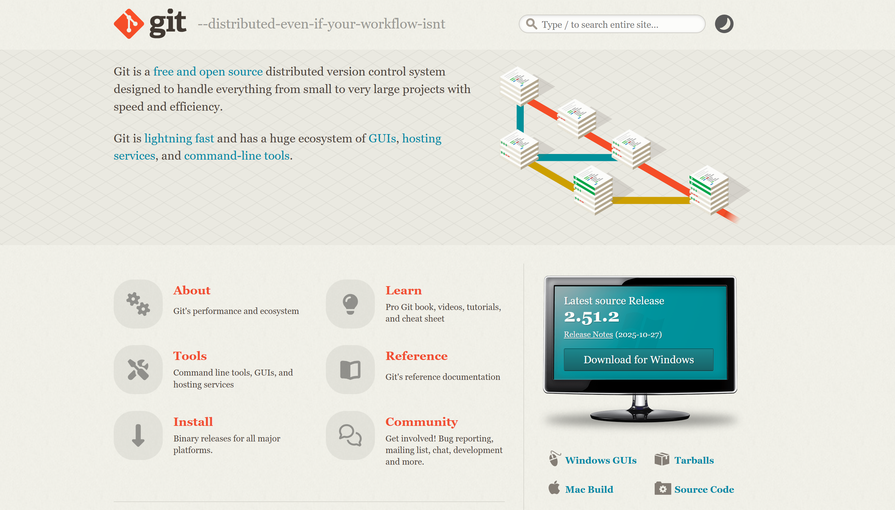
选择Download for windows。
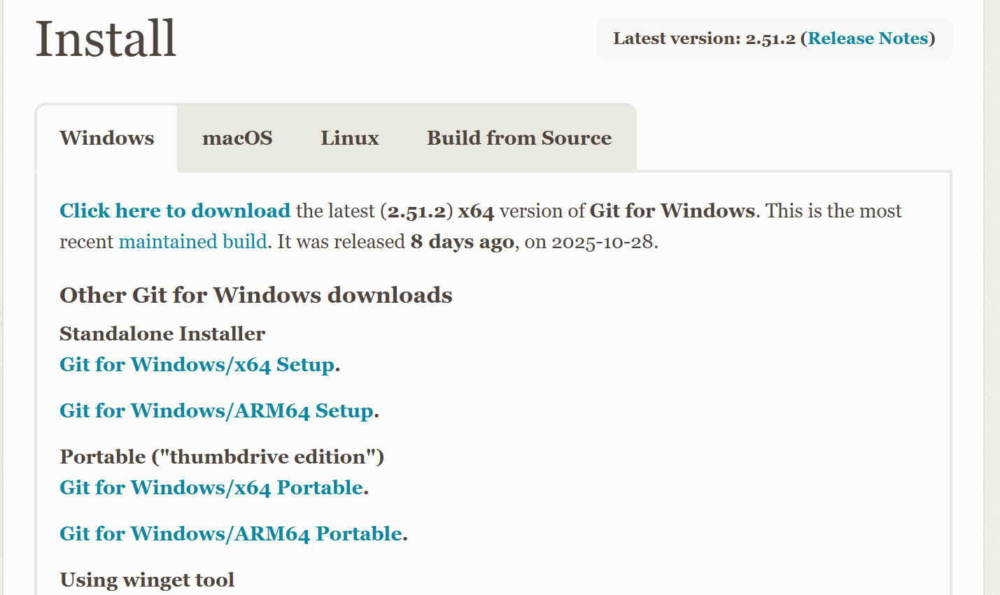
大家的电脑应该都是x64架构，所以这里我们选择Git for Windows/x64 Setup进行下载。
等待下载完成。（注：建议开梯子进行下载，不然速度会慢到怀疑人生•᷄ࡇ•᷅，没有梯子可以直接找刘昱辰要安装包）
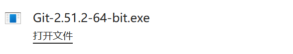
双击下载的exe文件打开，选择一个安装的路径，一直Next即可
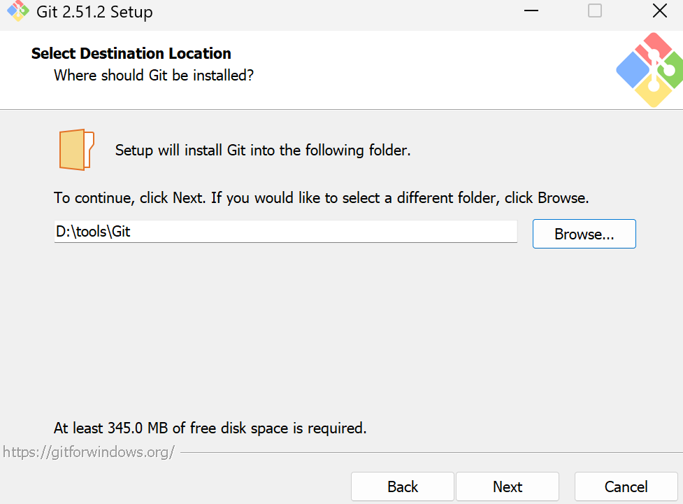
安装完成后，搜索并打开 git bash：
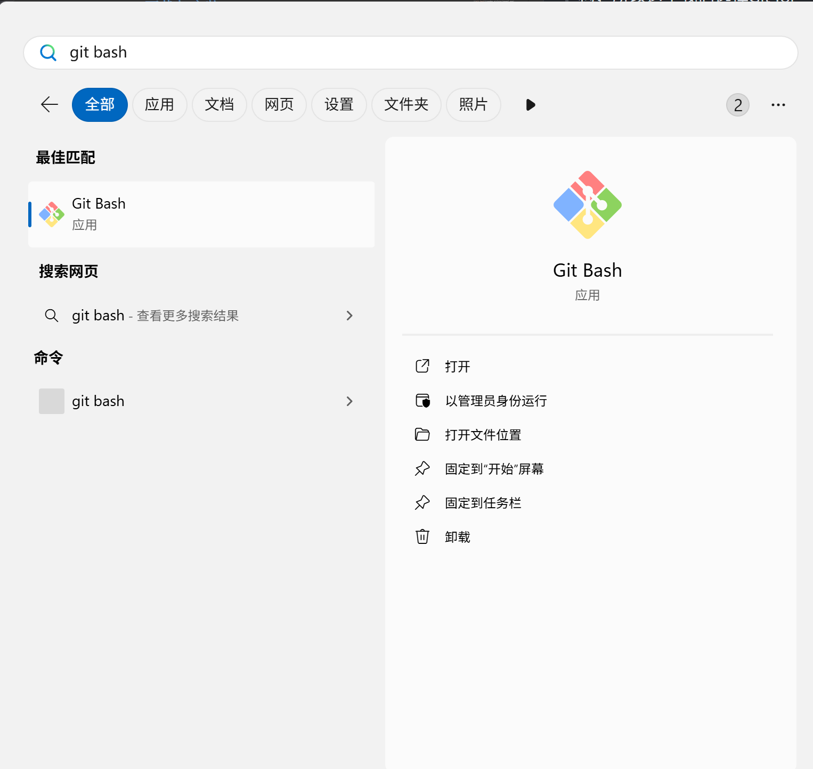
输入以下代码配置个人信息：
```
git config --global user.name "Your Name"
git config --global user.email "email@example.com"
```
完成这一步之后就可以愉快的下载代码啦，我们可以创建一个自己想要用来存储工程的文件夹，并右键选择open Git Bash here
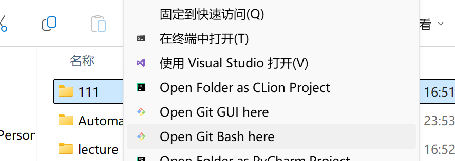
接着打开朱老师的gitea网站，找到我们想要克隆的代码，点击蓝色的代码按钮并复制网址：
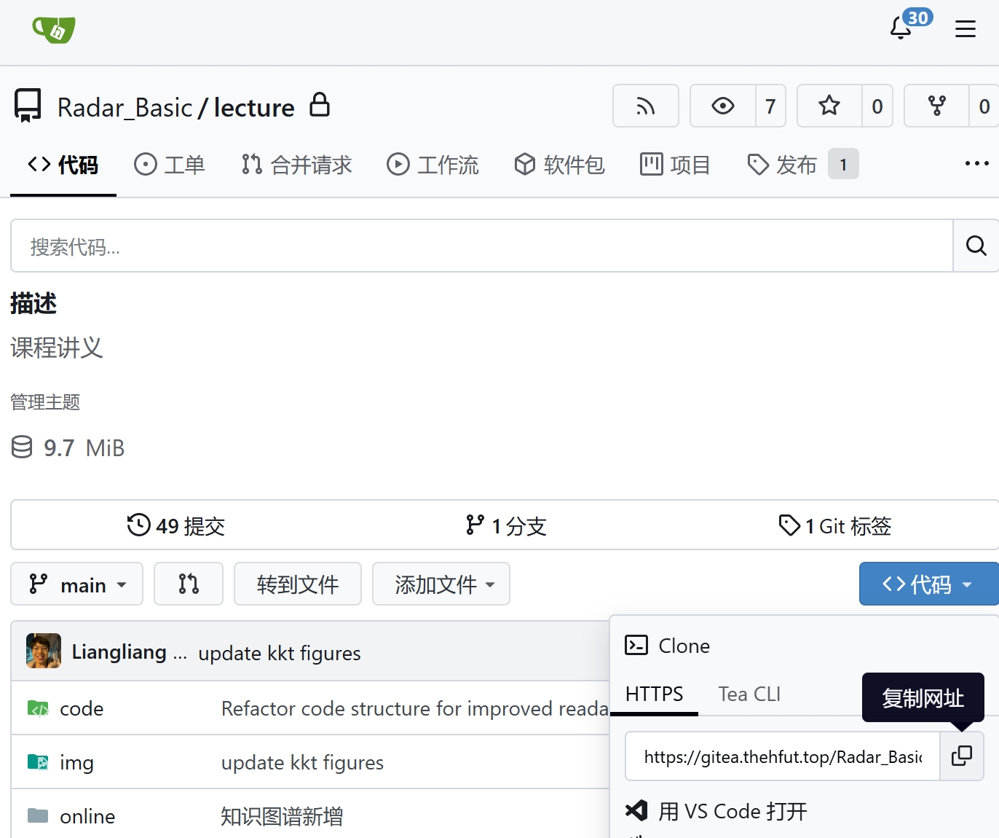
回到git bash 的窗口，在其中输入以下代码：
```
git clone 复制的网址
```
等待一会就能在文件夹中看到克隆的代码啦
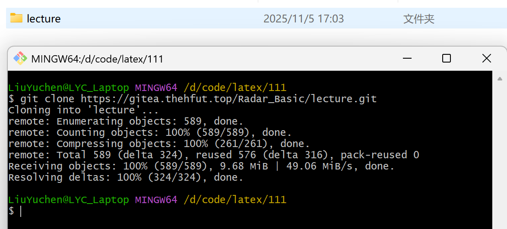
注：对git不熟悉的同学可以到以下网址进行学习：
https://git-scm.com/book/zh/v2
## vscode环境配置
右键刚才克隆的代码，选择用vscode打开文件夹：
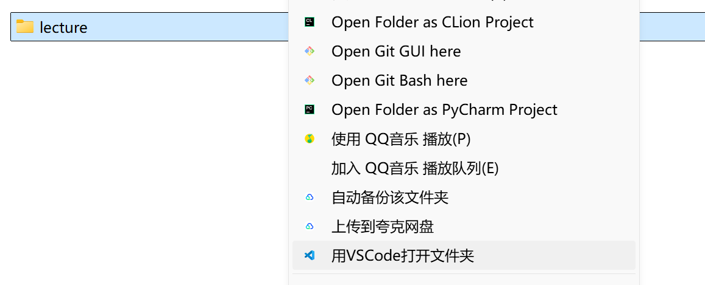
搜索扩展LaTex Workshop，点击齿轮图标选择安装特定版本：
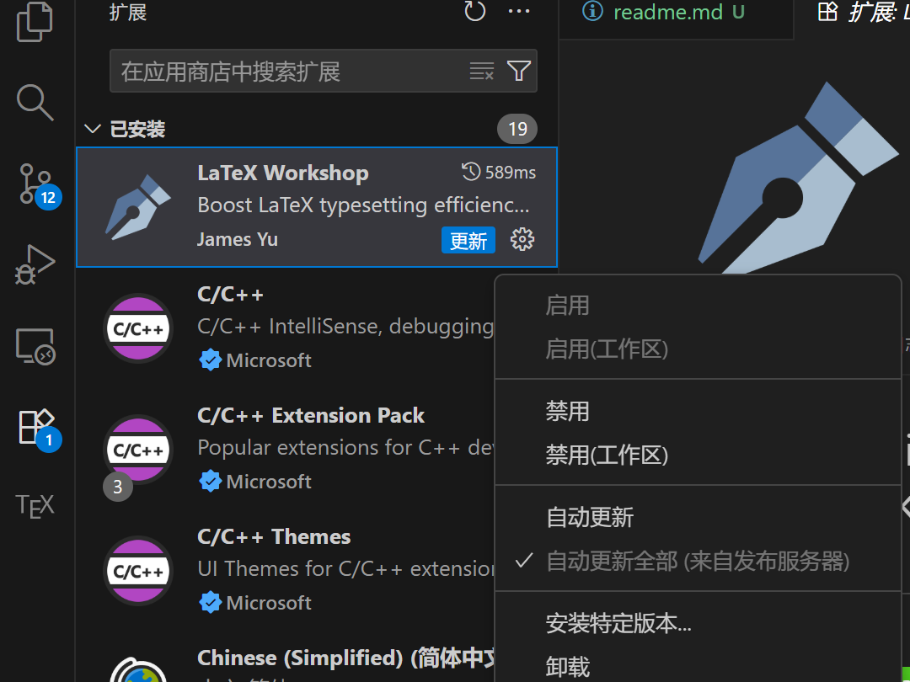
注意这里我们要选择10.11.1版本进行安装，不要安装最新版，会有中文显示的bug
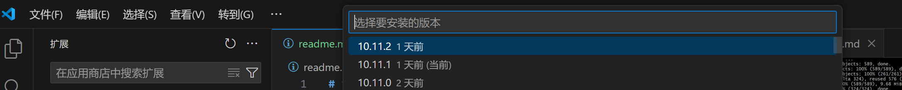
安装完成后点击左下角的齿轮打开设置：
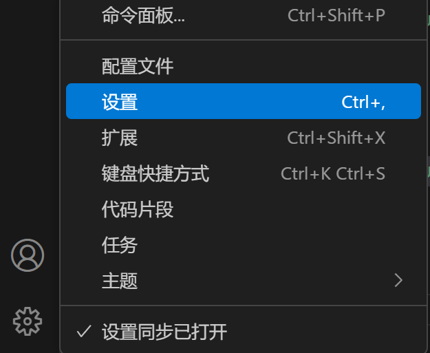
点击右上角的按钮打开settings.json文件
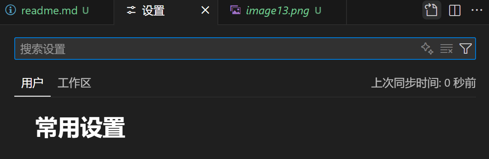
在其中输入以下代码：
```json
"latex-workshop.hover.preview.mathjax.extensions": [
    "boldsymbol"
    ],
    "latex-workshop.intellisense.package.enabled": true,
    "latex-workshop.latex.outDir": "./tmp",
    "latex-workshop.latex.recipe.default": "lastUsed",
    "latex-workshop.mathpreviewpanel.cursor.enabled": true,
    "latex-workshop.message.error.show": false,
    "latex-workshop.message.warning.show": false,   
    "latex-workshop.view.pdf.invert": 1,
    "latex-workshop.view.pdf.invertMode.enabled": "auto",
    "latex-workshop.latex.recipes": [
    {
        "name": "XeLaTeX",
        "tools": [
            "xelatexmk"
        ]
    },
    {
        "name": "PdfLaTeX",
        "tools": [
            "pdflatexmk"
        ]
    }
    ],
    "latex-workshop.latex.tools": [
    {
        "args": [
            "-synctex=1",
            "-pdfxe",
            "-interaction=nonstopmode",
            "-file-line-error",
            "-outdir=%OUTDIR%",
            "%DOC%"
        ],
        "command": "latexmk",
        "env": {},
        "name": "xelatexmk"
    },
    {
        "args": [
            "-synctex=1",
            "-pdf",
            "-interaction=nonstopmode",
            "-file-line-error",
            "-outdir=%OUTDIR%",
            "%DOC%"
        ],
        "command": "latexmk",
        "env": {},
        "name": "pdflatexmk"
    }
    ],
```
## 字体包安装
在正式使用vscode进行编译之前，我们还需要安装字体包，否则可能会出现8k+个errors的情况（血泪 ╥﹏╥）

进入如下网址：
https://gitea.thehfut.top/Radar_Basic/lecture/releases/tag/font
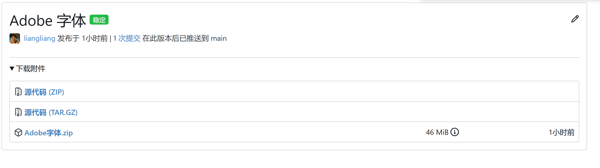
选择Adobe字体进行下载

下载完成后进行解压，进入解压后的文件夹，cltr+A全选，点击右键，选择为所有用户安装：
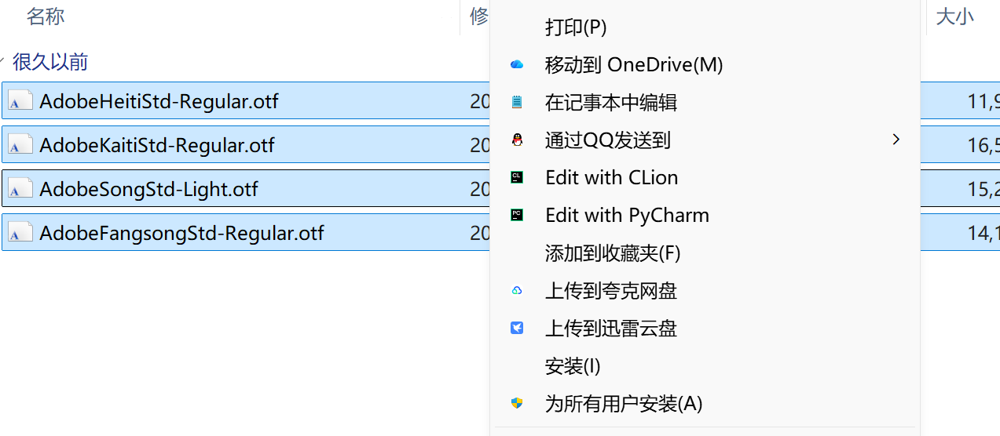

安装完成后，打开vscode进行编译，正常来说，此时应该就可以编译通过了。
